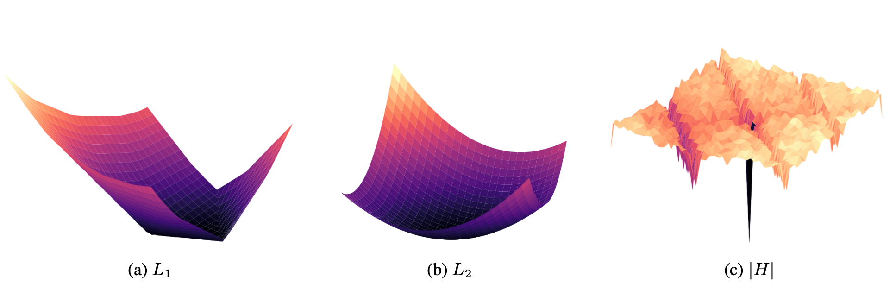

# MDL-LSTM

Code and results for ["Bridging the Empirical-Theoretical Gap in Neural Network Formal Language Learning Using Minimum Description Length"](https://aclanthology.org/2024.acl-long.713/).

* To reproduce the plots and results from the paper, see `paper-plots.ipynb`.

Main files:

| File                | Description                          |  
|---------------------|--------------------------------------|
| golden_an_bn_net.py | Golden aⁿbⁿ PyTorch module           |
| results.csv         | Grid search results                  |
| grid.py             | Hyper-parameters grid                |
| experiments.py      | Grid-search runner                   |
| paper-plots.ipynb   | Paper plots and table reproduction   |
| test_networks.py    | Tests for golden network correctness |
